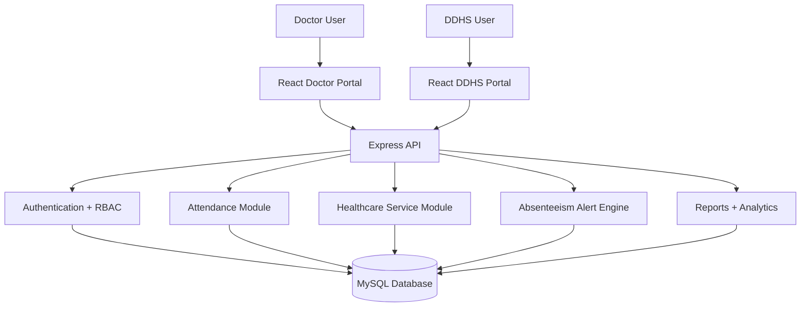

# PHC CONNECT System Architecture

## Overview
PHC CONNECT is a district monitoring platform for doctor attendance, healthcare service activity, absenteeism alerts, and reporting. The system is intentionally scoped to operation-level monitoring without adding unrelated clinical modules.

## Core components

### Doctor Portal
- Login and JWT-based session
- Dashboard with assigned facility context
- Attendance marking and history
- Service reporting for the assigned facility
- Role-scoped access to doctor-only functionality

### DDHS Portal
- District, taluk, facility, and type filtering
- Facility-level doctor monitoring
- Attendance and service visibility
- Absenteeism review and alert actions
- Reports and analytics views

### API Layer
- Express server with route grouping by role and domain
- JWT validation and RBAC enforcement
- Request validation and safe error handling
- Audit logging for security and operational actions

### Data Layer
- MySQL with schema-driven tables for users, roles, doctors, facilities, attendance, service reports, alerts, and audit logs
- Parameterized queries for safe database interaction

### Alert Engine
- Evaluates attendance compliance against configured time policy
- Creates absenteeism alerts without duplicates
- Supports alert acknowledgement and resolution lifecycle

### Reports Engine
- Consolidates attendance, services, alert, and facility data
- Supports district, taluk, facility, and facility-type filtering
